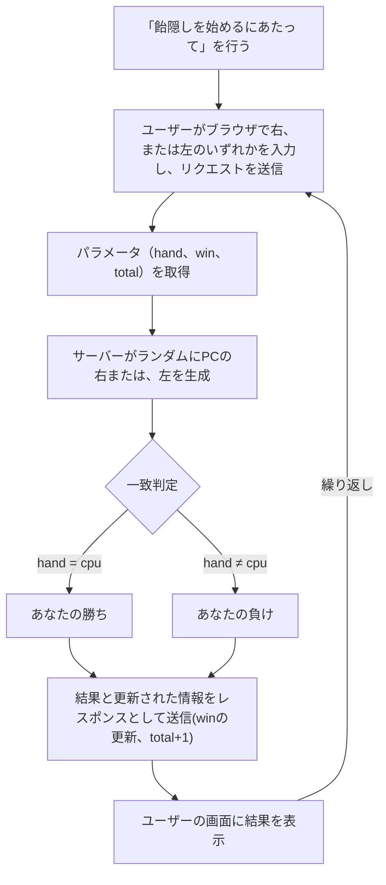
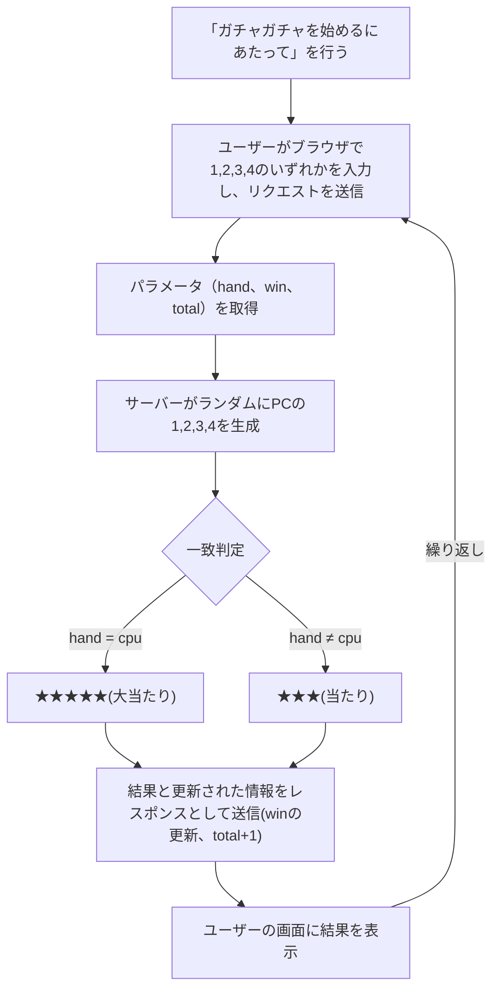
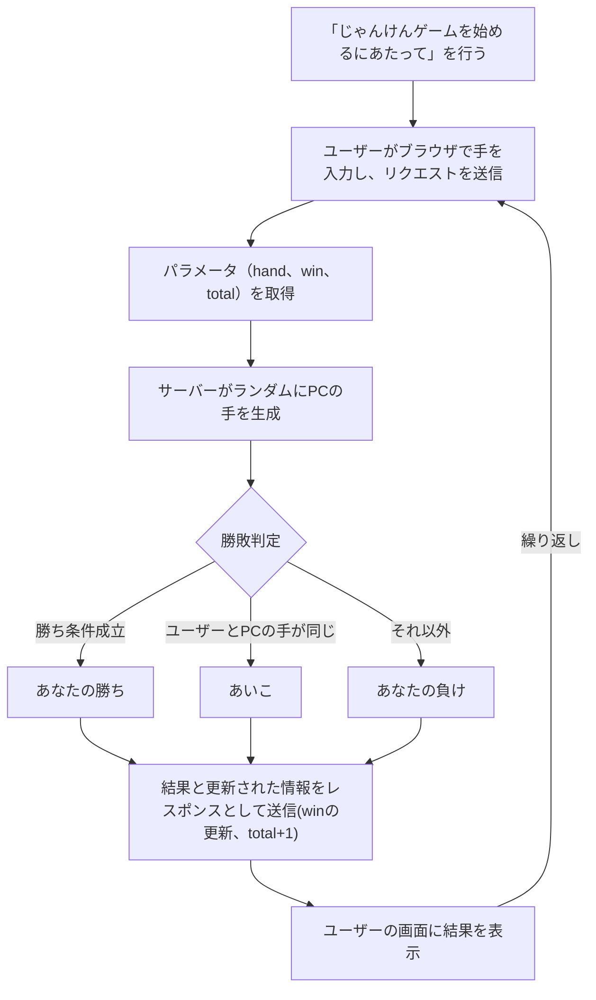

# webpro_06の説明
2024/10/29
2024/12/27

## <飴隠し>
#### 飴隠しのファイル一覧
ファイル名 | 説明
-|-
app5.js | プログラム本体
public/Amekakushi.html | 静的な飴隠しの開始画面
views/Amekakushi.ejs | 動的なじゃんけんの画面

#### 飴隠しを始めるにあたって
1. 飴隠しを始めるためにターミナルに以下のコマンドを打ち込み、WEBサーバーを構築する

片方のターミナル | もう片方のターミナル
-|-
node app5.js | telnet localhost 8080
-| GET /rest HTTP/1.1
-|Host: localhost

2. ブラウザで以下のURLにアクセスする
http://localhost:8080/public/Amekakushi.html

これで飴隠しを始めるのに必要なサーバー構築を終えた。

#### 飴隠しの機能説明
「飴隠し」は、ユーザーとPCが対戦するシンプルなゲームで、PCがどちらの手に飴を隠しているのかをユーザーが当てたら勝ちである。選んだユーザーは「右」または「左」のどちらかを選択する。一方、PC側はランダムに「右」または「左」を選ぶ。選択後、以下の処理が行われる。

1. ユーザーが選んだ手（右または左）と、PCが選んだ手が画面に表示される。
2. ユーザーの選択とPCの選択を比較し、次のように判定する。
    ・一致：ユーザーの「勝ち」
    ・不一致：ユーザーの「負け」
3. 勝利数（win）と試行回数（total）が更新され、現在の成績として画面に表示される。

この過程は何度でも繰り返すことができる。

#### 飴隠しのフローチャート

## <ガチャガチャ>

#### ガチャガチャのファイル一覧
ファイル名 | 説明
-|-
app5.js | プログラム本体
public/Gatyagatya2.html | 静的なガチャガチャの開始画面
views/Gatyagatya2.ejs | 動的なガチャガチャの画面

#### ガチャガチャを始めるにあたって
1. ガチャガチャを始めるためにターミナルに以下のコマンドを打ち込み、WEBサーバーを構築する

片方のターミナル | もう片方のターミナル
-|-
node app5.js | telnet localhost 8080
-| GET /rest HTTP/1.1
-|Host: localhost

2. ブラウザで以下のURLにアクセスする
http://localhost:8080/public/Gatyagatya2.html

これでガチャガチャを始めるのに必要なサーバー構築を終えた。

#### ガチャガチャの機能説明
ガチャガチャは、ユーザーとPCが数字を選んで、大当たり（★★★★★）を狙うシンプルなゲームだ。ユーザーはブラウザ上に表示される選択肢（1, 2, 3, 4のいずれか）から数字を選ぶ。一方、PC側は乱数を用いて1から4のいずれかを選択する。選択後、以下の処理が行われる。

1. ユーザーとPCの選んだ数字が画面に表示される。
2. 選んだ数字が一致した場合、大当たり（★★★★★）となり、勝利数が増加する。不一致の場合は当たり（★★★）として表示される。
3. 総試行回数や大当たり数などの統計情報が更新され、画面に表示される。

この過程は何度でも繰り返すことができる。

#### ガチャガチャのフローチャート

##　<じゃんけん>

#### じゃんけんのファイル一覧
ファイル名 | 説明
-|-
app5.js | プログラム本体
public/janken.html | 静的なじゃんけんの開始画面
views/janken.ejs | 動的なじゃんけんの画面

#### じゃんけんゲームを始めるにあたって
1. じゃんけんゲームを始めるためにターミナルに以下のコマンドを打ち込み、WEBサーバーを構築する

片方のターミナル | もう片方のターミナル
-|-
node app5.js | telnet localhost 8080
-| GET /rest HTTP/1.1
-|Host: localhost

2. ブラウザで以下のURLにアクセスする
http://localhost:8080/public/janken.html

これでじゃんけんを始めるのに必要なサーバー構築を終えた。

#### じゃんけんの機能説明
じゃんけんは、ユーザーとPCが対戦するシンプルなゲームである。ユーザーはブラウザ上に表示される選択肢（グー、チョキ、パー）からじゃんけんの手を選ぶ。一方、PC側は乱数を用いて手を決定する。手の選択後、以下の処理が行われる。

1. ユーザーとPCの手が画面に表示される。
2. 勝敗または引き分けの判定が行われ、その結果が表示される。
3. 勝数や試合数などの統計情報が更新され、画面に表示される。

この過程は何度でも繰り返すことができる。

#### じゃんけんのフローチャート
