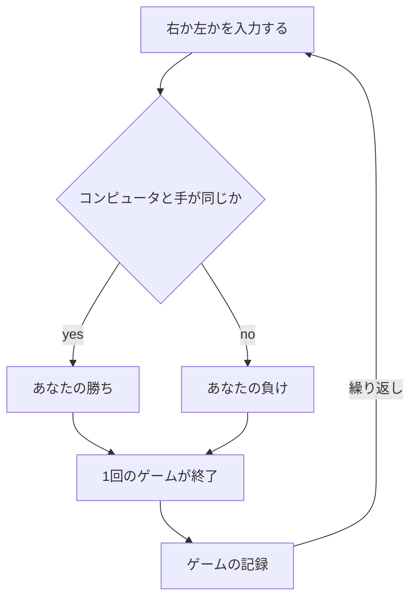
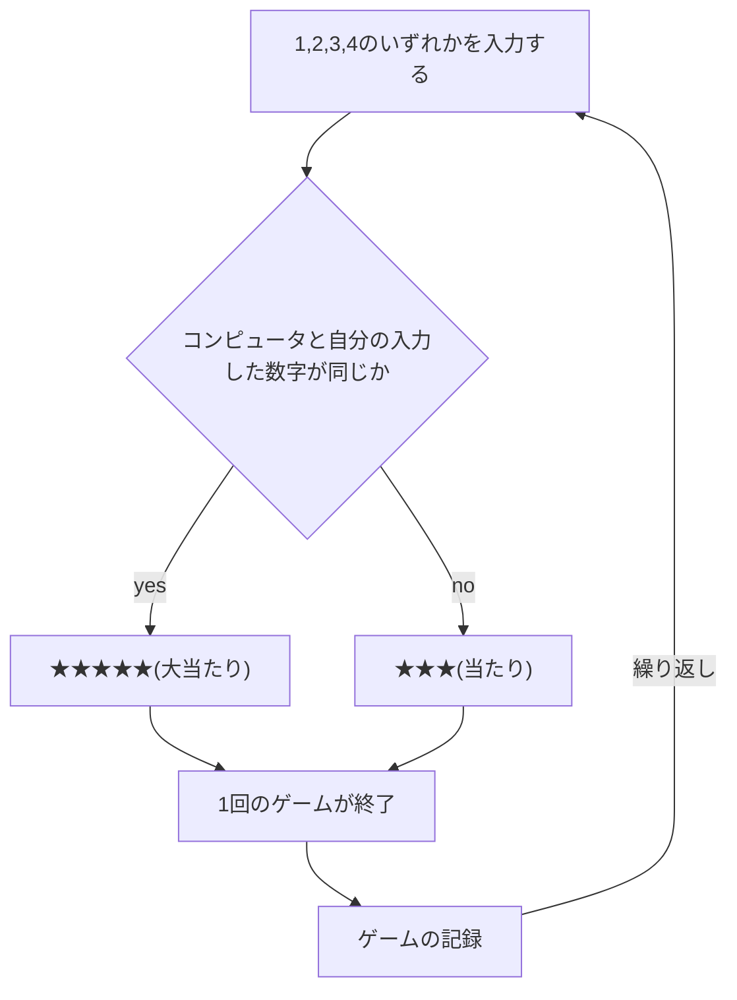

# webpro_06
2024/10/29

#### 飴隠しのファイル一覧
ファイル名 | 説明
-|-
app5.js | プログラム本体
public/Amekakushi.html | 飴隠しの開始画面

#### 飴隠しのプログラムについて
1. app5.js を起動する
1. Webブラウザでlocalhost:8080/public/Amekakushi.htmlにアクセスする
1. 自分の手を入力する(右or左)
1. 勝敗判定を行う
1. 再度自分の手を入力する(右or左)場所に戻る

#### 飴隠しのプログラム内容
```javascript
app.get("/Amekakushi", (req, res) => {
  // ユーザーの手を "左" または "右" から取得し、デフォルトを "左" に設定
  let hand = req.query.hand || '左';
  let win = Number(req.query.win) || 0;
  let total = Number(req.query.total) || 0;
  console.log({ hand, win, total });

  // CPUの手をランダムで "左" または "右" に設定
  const num = Math.floor(Math.random() * 2 + 1);
  let cpu = '';

  if( num==1 ) cpu = '左';
  else  cpu = '右';

  // 勝敗判定
  let judgement = '';

  if (hand === cpu) {
    judgement = '勝ち';
    win += 1;
  } else {
    judgement = '負け';
  }

  total += 1;  // ゲームの総数を1つ増やす

  const display = {
    your: hand,
    cpu: cpu,
    judgement: judgement,
    win: win,
    total: total
  };
  console.log(display);
  res.render('Amekakushi', display);
});

app.listen(8080, () => console.log("Example app listening on port 8080!"));
```

```Amekakushi.ejs
<!DOCTYPE html>
<html lang="ja">
<head>
    <meta charset="UTF-8">
    <title>飴隠し</title>
</head>
<body>
    <p>飴隠し<p>
    <p>あなたの手は<%= your %>です．</p>
    <p>コンピュータは<%= cpu %>です．</p>
    <p>判定：<%= judgement %></p>
    <p>現在<%= total %>試合中<%= win %>勝しています．</p>
    <hr>
    <form action="/Amekakushi">
        <input type="text" name="hand" required>
        <label for="hand">右？左？</label>
        <input type="hidden" name="win" value="<%= win %>">
        <input type="hidden" name="total" value="<%= total %>">
        <input type="submit" values="右左どっちだ">
    </form>   
</body>
</html>
```

### 飴隠しのフローチャート




#### ガチャガチャのファイル一覧
ファイル名 | 説明
-|-
app5.js | プログラム本体
public/Gatyagatya2.html | ガチャガチャの開始画面

#### ガチャガチャのプログラムについて
1. app5.js を起動する
1. Webブラウザでlocalhost:8080/public/Gatyagatya2.htmlにアクセスする
1. 1,2,3,4のいずれかの数字を入力する
1. 当たりか大当たりかの判定を行う
1. 再度1,2,3,4を入力する場所に戻る

#### ガチャガチャのプログラム内容
```javascript
app.get("/Gatyagatya2", (req, res) => {
  
  let hand = req.query.hand || '0';
  let win = Number(req.query.win) || 0;
  let total = Number(req.query.total) || 0;
  console.log({ hand, win, total });

 const num = Math.floor(Math.random() * 4 + 1);
  let cpu = '';

  if( num==1 ) cpu = '1';
  else if (num==2) cpu = '2';
  else if (num==3) cpu = '3';
  else cpu = '4';

  // 勝敗判定
  let judgement = '';

  if (hand === cpu) {
    judgement = '★★★★★(大当たり)';
    win += 1;
  } else {
    judgement = '★★★(当たり)';
  }

  total += 1;  // ゲームの総数を1つ増やす

  const display = {
    your: hand,
    cpu: cpu,
    judgement: judgement,
    win: win,
    total: total
  };
  console.log(display);
  res.render('Amekakushi', display);
});

app.listen(8080, () => console.log("Example app listening on port 8080!"));
```

```Gatyagatya2.ejs
<!DOCTYPE html>
<html lang="ja">
<head>
    <meta charset="UTF-8">
    <title>ガチャガチャ</title>
</head>
<body>
    <p>ガチャガチャ<p>
    <p>あなたの手は<%= your %>です．</p>
    <p>コンピュータは<%= cpu %>です．</p>
    <p>判定：<%= judgement %></p>
    <p>現在<%= total %>試合中<%= win %>勝しています．</p>
    <hr>
    <form action="/Gatyagatya2">
        <input type="text" name="hand" required>
        <label for="hand">1,2,3,4のどれかを当てよう</label>
        <input type="hidden" name="win" value="<%= win %>">
        <input type="hidden" name="total" value="<%= total %>">
        <input type="submit" values="1,2,3,4のどれかを当てよう">
    </form>   
</body>
</html>
```

### ガチャガチャのフローチャート

